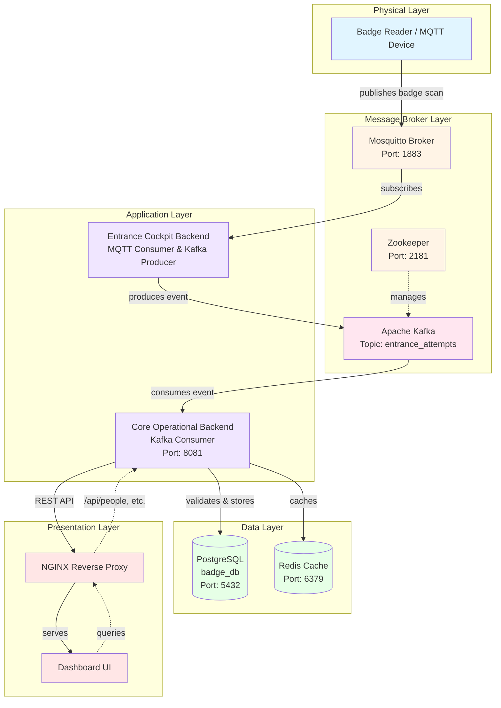

# Badge Entrance Simulation — Roadmap

A DevOps- and infra-focused simulation of a company entrance system. Employees “scan” a badge; backend microservices validate, authorize, log, and signal a (mock) door lock. No embedded work—only software simulation and service integration.

---

## 🧱 Architecture (high level)





**Clients & IoT (simulated)**
- *Entrance Cockpit (Web UI)* — Real‑time dashboard; manual authorize/deny.
- *Badge Sensor (Mock MQTT client)* — Publishes badge scans.
- *Door Lock (Mock MQTT client)* — Subscribes to authorization decisions.

**Gateway**
- *NGINX* — TLS termination, routing to backends, WebSocket proxy, gRPC passthrough.

**Microservices (Dockerized)**
- *entrance-cockpit-backend (Spring Boot)* — REST/WebSocket for cockpit, exposes admin ops, consumes Kafka logs.
- *core-operational-backend (Spring Boot)* — Badge validation and authorize/deny decision; interacts with Redis/PostgreSQL; publishes to MQTT & Kafka.
- *telemetry-messaging-backend (Node.js)* — Bridges MQTT ↔ Kafka; normalizes telemetry.
- *cache-loader-backend (Spring Boot)* — Periodically syncs PostgreSQL → Redis.

**Data & Messaging**
- *PostgreSQL* — Registered people, audit.
- *Redis* — Hot cache of registered/active badges.
- *Kafka* — Topics for `attempt-logs` and `entrance-logs`.
- *MQTT broker (Mosquitto/EMQX)* — Topics for `iot/entrance/badge` and `iot/entrance/decision`.

---

## 🔄 End‑to‑End Data Flow (overview)

1) **Badge scan** → Badge Sensor publishes `{badge_id, ts}` to `iot/entrance/badge` (MQTT).  
2) **Core Operational** consumes scan (via bridge), checks **Redis → PostgreSQL** fallback, decides authorize/deny.  
3) **Decision** → Publishes decision to `iot/entrance/decision` (MQTT). Door Lock mock reacts.  
4) **Telemetry & Logs** → Sends structured events to **Kafka**: `attempt-logs` (all scans), `entrance-logs` (authorized).  
5) **Cockpit** → Backend streams logs to UI (WebSocket) and supports manual overrides (which publish a decision event).  
6) **Cache Loader** → Keeps Redis in sync with PostgreSQL at intervals.

---

## 🧰 Tech Stack

- **Runtime:** Spring Boot (Java 21), Node.js (LTS), HTML/CSS/JS (Vanilla or lightweight framework optional)
- **Infra (local):** Docker Compose, NGINX, Redis, PostgreSQL, Kafka (+ ZooKeeper), MQTT (Mosquitto)
- **Build/Dev:** Gradle/Maven, npm, Makefile
- **CI (later):** GitHub Actions or GitLab CI
- **Observability:** Prometheus + Grafana, Loki (logs) — optional in Phase 3
- **Security:** mTLS (internal, optional), OAuth2/JWT (admin UI), secrets via env/.env + Docker secrets

---

## 📁 Repos & Structure (suggested)

```
/app
  /services
    /entrance-cockpit-backend  (spring)
    /core-operational-backend  (spring)
    /cache-loader-backend      (spring)
    /telemetry-messaging-backend (node)
    /iot
      /badge-sensor-mock (node)
      /door-lock-mock    (node)
  /web/entrance-cockpit-front  (static HTML/CSS/JS or minimal framework)
/deploy
  docker-compose.yml
  nginx/
    nginx.conf
  kafka/
    topics-init.sh
  postgres/
    init.sql
  mosquitto/
    config/
      mosquitto.conf

  grafana/ prometheus/ (optional later)
/docs
  README.md
  microscope.md
Makefile
```

---

## 🗺️ Phased Roadmap

### Phase 0 — Bootstrap
- Create repo layout, base Dockerfiles, Compose with: PostgreSQL, Redis, Kafka+ZooKeeper, Mosquitto, NGINX.
- Health-check containers up; expose NGINX 80/443; seed DB with sample users.

### Phase 1 — Service Skeletons
- Spring Boot scaffolds for **core-operational**, **cockpit-backend**, **cache-loader**.
- Node.js scaffold for **telemetry-messaging-backend**.
- Define common models/DTOs, error handling, and config (env‑driven).

### Phase 2 — Messaging & Topics
- MQTT topics: `iot/entrance/badge`, `iot/entrance/decision`.
- Kafka topics: `attempt-logs`, `entrance-logs`.
- Implement Node bridge: MQTT → Kafka (`attempt-logs`) and Core → MQTT for decisions.

### Phase 3 — Core Flow
- Redis-first badge validation with PostgreSQL fallback.
- Publish decision to MQTT; write structured events to Kafka.
- Add **cache-loader** job that syncs DB → Redis periodically.

### Phase 4 — Cockpit
- Static UI served via NGINX or spring static.
- **cockpit-backend** exposes WebSocket for live logs (from Kafka consumer) and manual authorize endpoint → publish decision.

### Phase 5 — Observability & CI
- Add Prometheus/Grafana and Loki stack (optional).
- Wire dashboards: Kafka lag, service JVM metrics, MQTT msg rate, NGINX.
- GitHub Actions: build images, run unit tests, spin compose for integration tests.

### Phase 6 — Hardening & Extras
- Secrets handling, TLS between NGINX and services, rate limiting.
- Chaos/fault tests (drop Kafka/MQTT briefly), backpressure handling.
- Persisted volumes and data retention policies.

---

## ✅ Acceptance Criteria (selected)

- A badge scan from the mock results in:  
  **(a)** a decision event to the door-lock mock, **(b)** an entry in `attempt-logs`, and **(c)** a cockpit UI update in < 2s.
- Manual authorize from cockpit immediately opens the lock mock (decision event).
- Cache loader refreshes Redis on schedule; DB updates reflect in cache.
- All services build & run via `docker compose up` with one command.

---

## 🧪 Testing Strategy

- Unit tests for service logic (Spring/Node).  
- Integration tests using Testcontainers (Java) and Docker Compose.  
- Contract tests for message schemas (MQTT payloads, Kafka Avro/JSON).

---

## ▶️ Quickstart (once implemented)

```bash
# 1) Build all images
make build

# 2) Start stack
docker compose -f deploy/docker-compose.yml up -d

# 3) Tail logs
docker compose -f deploy/docker-compose.yml logs -f

# 4) Open Cockpit
open http://localhost:8080  # or through NGINX http://localhost
```

---

## 📚 Docs

- `docs/microscope.md` — step-by-step checklist (execution plan)
- `docs/architecture.drawio` — diagram source
- `docs/api/*.md` — REST/WebSocket contracts
- `docs/messaging/*.md` — MQTT/Kafka schemas & topics
